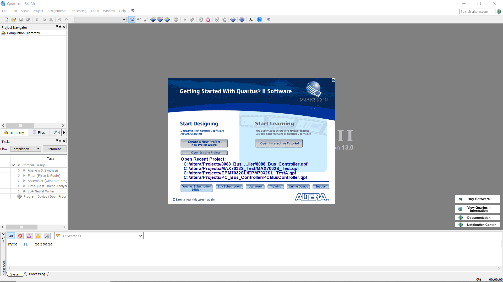
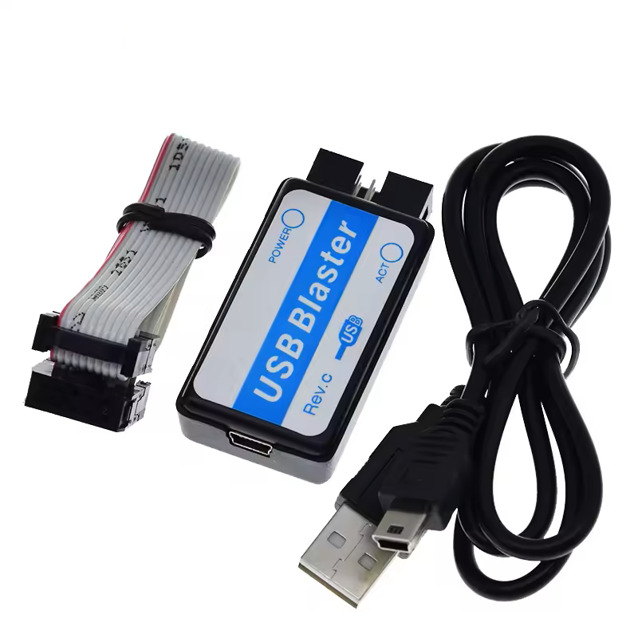
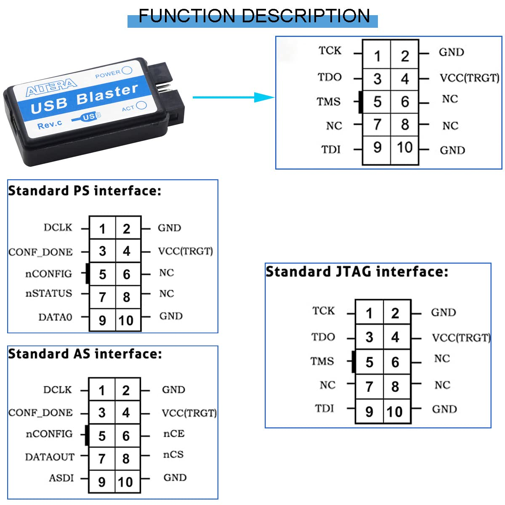

# COMPLEX PROGRAMMABLE LOGIC DEVICE ( CPLD )

# Preambolo

Per ridurre il numero di componenti e la complessità del cablaggio, visto che per la realizzazione del progetto si utilizzeranno una o più Bredboard,
è piu che plausibile utilizzare le logiche programmabili.
I costruttori di personal computer da anni utilizzano questo tipo di dispositivi riducendo complessità e costi produttivi.

Ridurre il numero di fili che costituiscono le connessioni tra i vari circuiti integrati è sicuramente una buona cosa.

La qualità dei contatti ( considerando come qualità una connessione con resistenza minima ) non è garantita. Riducendo il
numero di connessioni è possibile ridurre la resistenza e le problemeatiche dovute a contatti non ottimali dovuti alla
realizzazione meccanica ( caratteristiche meccaniche delle connessioni ), e alla qualità dei materiali.

La resistenza provoca una caduta di tensione ( Legge di Ohm V = R * I ). Le logiche di tipo TTL distinguono un valore logico 1
da un livello logico 0 solo se la tensione raggiunge il valore necessario ( >= 2,5~ Volt ).

La qualità dei contatti non è garantita neppure nelle schede standard PCB, ( saldature, ossidazione ) infatti molto spesso
le saldature dei componenti tendono a rompersi o a deteriorarsi aumentando cosi la resistenza tra pista in rame e terminali dei
componenti o addirittura l'interruzione della conessione stessa.

I terminali dei compomenti, predendo come esempio il loro inserimento negli "zoccoli o socket", tendono a creare problemi dovuti all'ossidazione.
I computer più vecchi in disuso e posti in ambienti relativamente umidi ( succede spesso nei vecchi Commodore ), smettono di funzionare
proprio a causa di questo inconveniente.

Playstation 3 ( caso eclatante ma non assolutamente isolato ) soffriva di rotture delle saldature dovute alla dilatazione dei
materiali, i quali, espandendosi e ritirandosi a causa del calore prodotto da alcuni circuiti integrati, interrompevano la connessione
tra terminali e PCB, causando malfunzionamento o il guasto totale della macchina.

Inoltre le correnti ad "alte" frequenzea tendono, passando attraverso i cavetti ( induttanze, Correnti indotte, Legge di Faraday ), a generare "rumore". Questo "rumore" potrebbe influenzare i segnali che transitano attraverso i cavetti posti vicini, per tutta la loro lunghezza. Più connessioni dunque potrebbero creare disturbi incontrollati.

E' da ricordare che i cavi sono per lora stessa natura dei resistori.

SE QUESTI FATTORI NON FOSSERO CONSIDERATI CON IL DOVUTO RIGUARDO, POTREBBERO VERIFICARSI SPORADICI MALFUNZIOMANTI O IL MALFUNZIONAMENTO TOTALE.

OK, detto questo, ( la spiegazione scientifica ), passiamo alla parte divertente !

Utilizzando il software Altera ( Intel ) Quartus II è possibile "progettare" graficamente il funzionamento del dispositivo CPLD.
Inoltre sono fornite librerie che contengono molti circuiti logici di base, quindi è possibile posizionare questi circuiti nel
grafico del funzionamento del dispositivo, realizzare, sempre graficamente le connesioni dei vari terminali ed il gioco è fatto.

La serie 7000 di Altera è pienamente compatibile con i livelli di tensione, 5 Volt, dei vecchi processori 8088.

Il tempo di propagazione dei segnali propri dei semiconduttori porte logiche, sono pienamente rispettati.

Le correnti prelevabili da ogni singolo terminale sono sufficienti, se si tengono in considerazione le problematiche descritte sopra.

## Altera serie 7000

> [!NOTE]
> Non è disponibile un adattatore PLCC68 DIP68 o PLC84 DIP84. Il numero di porte di una singola logica programmabile non
> è sufficiente per gestire tutti i segnali necessari. Per il momento ne verrano utilizzate due. Successivamente verrà utilizzata una logica
> programmabile con package 100-Pin TQFP.

Costo irrisorio.
Programmabile via JTag ( Altera USB Blaster ).
Compatibile con logica TTL 5 Volt.
Velocità di gestione dei segnali pienamente compatibile con le frequenze utilizzate.

## Software per la programmazione datato ma gratuito.

DOWNLOAD:
[Datasheet, Manuali, Software](https://drive.google.com/drive/folders/0B2-T0Hc3d6D9NHljNFdQeFpJUWc?resourcekey=0-ugqx4FYDp2y661hUuebmaA&usp=drive_link)

[QUARTUS TUTORIAL](https://www.youtube.com/watch?v=a8JAkKhxlQI&list=PL57F1D26AD6D50FA7&index=1)

## Programmatore JTag Altera

[Altera USB Blaster](https://it.aliexpress.com/item/1005006358681875.html?spm=a2g0o.productlist.main.4.433f5UYI5UYInK&aem_p4p_detail=20250525063522241667427691360008044577&algo_pvid=ed02d69b-7d8a-4d2b-b725-92a8046dfe94&algo_exp_id=ed02d69b-7d8a-4d2b-b725-92a8046dfe94-3&pdp_ext_f=%7B%22order%22%3A%2212%22%2C%22eval%22%3A%221%22%7D&pdp_npi=4%40dis%21EUR%213.39%213.39%21%21%2126.96%2126.96%21%40211b629217481801220534064efdb5%2112000036881869231%21sea%21IT%211623848473%21X&curPageLogUid=4arPD6bJmNeW&utparam-url=scene%3Asearch%7Cquery_from%3A&search_p4p_id=20250525063522241667427691360008044577_1)

# Adattatore PLCC44 to DIP44

[PLCC44 to DIP44](https://it.aliexpress.com/item/1005007005553613.html?spm=a2g0o.order_list.order_list_main.5.346f3696RVbWoq&gatewayAdapt=glo2ita)

## COSI SI PUO' DIRE CHE UN'ALTRO PROBLEMA E' RISOLOTO!